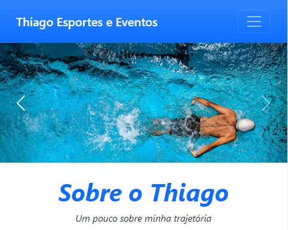

# Projeto de Desenvolvimento Web | Fatec

## 🌎 Página Web Thiago Eventos e Esportes



> Esta é a página inicial do site do Thiago, onde os clientes poderão conhecer sua trajetória profissional, a paixão pelos esportes e sua dedicação nos eventos que organiza e participa.

### Linguagens utilizadas

<div style="justify-content-center">
   
  
</div>

## 📱 Usando Thiago Eventos e Esportes

Para usar a página:

```
<utilize um navegador web, de preferência via celular.>
```

## 👩‍💻 Desenvolvedoras

<div style = "justify-content-center">
  <a href="https://github.com/Giuliana09">Giuliana |</a>
  <a href="https://github.com/LarissaSL">Larissa |</a>
  <a href="https://github.com/SilvanaMenezes">Silvana</a> 
</div>

## 📝 Licença

Esse projeto está sob licença. Veja o arquivo [LICENÇA](LICENSE.md) para mais detalhes.
